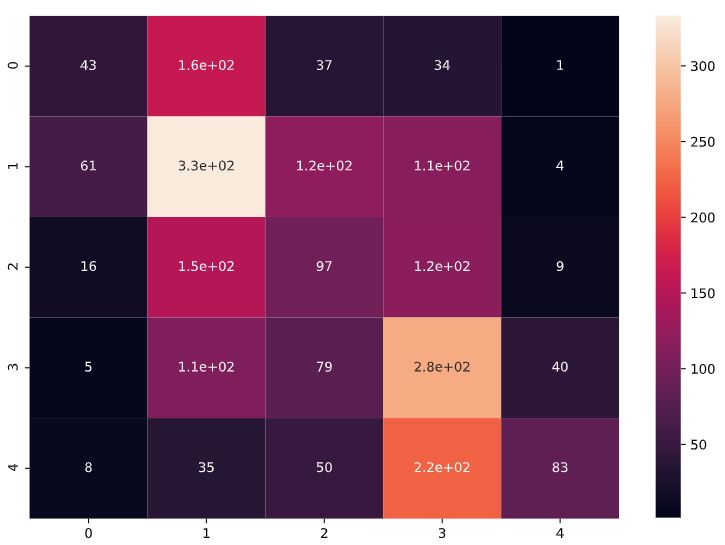

# stanford-sentiment-analysis

## Dataset
We're using the Stanford Sentiment Treebank (SST-5) for fine-grained sentiment analysis from https://nlp.stanford.edu/sentiment/index.html.  
It consists of various movie reviews from Rotten Tomatoes labeled manually by various annotators on a 5 point scale. 1 being very negative and 5 being very positive.  
We've use Python's pytreebank package which provides various utilities for downloading, importing and visualizing the SST-5 dataset.

# Models
1) The first model uses TF-IDF embeddings and an FF network.  
 - The model's accuracy improves significantly over the training data but performance on the validation data degrades with every epoch.
 - Stopping training early doesn't seem feasible as validation loss increases with almost every epoch
 - Resulting model produces the following confusion matrix on test data  
 
 - As we can see, the model ends up acting more like a binary classifier with high accuracy on 'Negative' and 'Positive' reviews but fails to measure nuances.
 - Model has a validation accuracy of 37.43% and test accuracy of 37.77%  
 - The model has an f1 score of 0.3349

2) The second model uses Fasttext sentence embeddings with an FF network.
- The model's accuracy improves over training but not by a significant amount.
- Validation accuracy changes over epochs but with no major change.
- Resulting model produces the following confusion matrix on test data  

- The model still ends up acting more like a binary classifier, but it performs slightly better on 'Highly Negative' and 'Highly Positive' reviews.
- The model has a validation accuracy of 41.78% and test accuracy of 44.12%
- The model has an f1 score of 0.4106